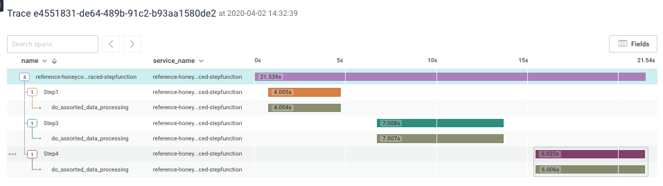

# reference-honeycomb-traced-stepfunction

This is a very basic hacky example of using a combination of beeline and lib-honey to trace a fully async step function in AWS.



We use a few tricks to achieve this;

* passing the trace_context in the step function input and output payloads
* using the lib-honey event class to manually generate the final payload which closes the trace

**Limitations**

* sfn input and output has a size limit, it may make sense to store the trace_context and parent_context elsewhere if your payloads are size sensitive
* you cannot add trace level context fields except during the first Step when the event is in the stack, and the final step when creating the manual event
* all steps appear under the root span, this was intentional since I personally find it more readable, but that could be worked around by passing the root_trace_context as well as the trace_context in the payload

## TODO

* figure out how to allow adding context fields during all traces

## Deployment

If you want to see this in action you'll need to:

* add your write_key in secrets manager under path `honeycomb_write_key`
* run the build and deployment

```
make package deploy-stepfunction-cloudformation
```

### Attributions

https://github.com/OsamaJBR/teach-me-aws-stepfunctions
https://github.com/danilop/first-step-functions